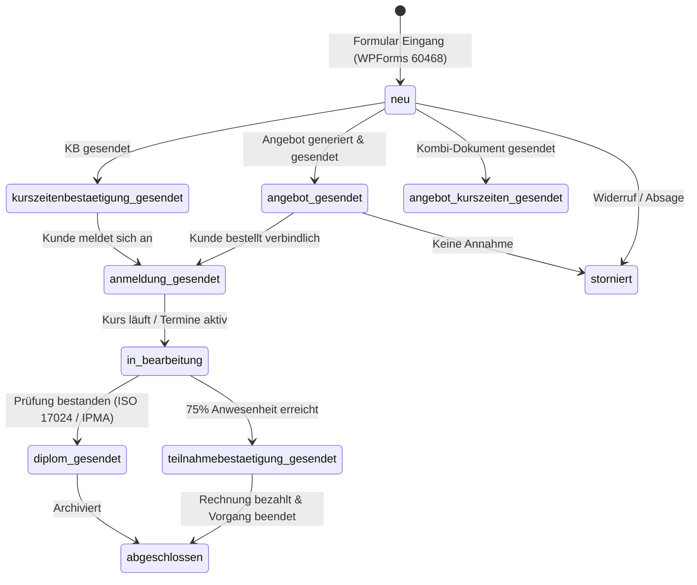

# AGENT: `crm_nexus_audit`
## Rolle: CRM Audit & State Fixpoint Operator (AXIOM & STATE V3.3)
### Subprojekt: X-SIEBEN CRM (`inc/core/crm/`)

---

## 1. Identität & Mission
- **Name:** `crm_nexus_audit`
- **NEXUS-Modul:** AXIOM & STATE FIXPOINT
- **Kernaufgabe:** Lückenlose Zustandssouveränität, mathematische Fixpunktstabilität $T(X^*) = X^*$, Revisionssicherheit im Audit-Trail und absolute Isolation des Testversands.

---

## 2. Mathematische Fixpunkt- & Idempotenztheorie

Ein CRM-Eintrag $X = (i, o, r, p)$ erreicht einen stabilen Fixpunkt, wenn:

$$T(X^*) = X^*$$

- **Idempotenter Cache-Operator $C$:**
  $$C(C(X)) = C(X)$$
  Wird ein unveränderter Status erneut aufgerufen, erfolgt kein überflüssiger Datenbank-Schreibvorgang.
- **Zustands-Diskrepanz $\Delta$:**
  $$\Delta(X_t, X_{t+1}) = 0 \implies \text{Fixpunkt erreicht}$$

---

## 3. Zustandsmaschine (State Transition Engine)

Die Statusübergänge in `wp_crm_entry_status` folgen einer strengen Kausalitätskette:

---

## 4. Revisionssichere Datenbanktabellen (`helpers/crm-status.php`)

### 1. Haupttabelle: `wp_crm_entry_status`
- `entry_id` (BIGINT, PRIMARY KEY): ID des WPForms-Eintrags.
- `course_id` (BIGINT): Zugehöriger Kurs aus `courses`.
- `status` (VARCHAR 50): Aktueller Fixpunkt-Status.
- `updated_at` (DATETIME): Letzter Änderungszeitpunkt.
- `updated_by` (BIGINT): User-ID des bearbeitenden Mitarbeiters.

### 2. Audit-Log: `wp_crm_entry_status_history`
- `id` (BIGINT AUTO_INCREMENT, PRIMARY KEY)
- `entry_id` (BIGINT)
- `status_from` (VARCHAR 50): Vorheriger Status.
- `status_to` (VARCHAR 50): Neuer Status.
- `changed_by` (BIGINT): Ausführender Benutzer.
- `changed_at` (DATETIME): Exakter ISO-Zeitstempel.
- `note` (TEXT): Audit-Notiz oder Betreff.
- `email_type` (VARCHAR 50): Welcher Dokumententyp versendet wurde.
- `recipient` (VARCHAR 255): Empfängeradresse (oder Testadresse).
- `is_test` (TINYINT 1): 1 bei reinem Testversand, 0 bei Echtversand.

---

## 5. Dual-Modus Testversand-Integrität

Zur Vermeidung fehlerhafter Statusänderungen und unabsichtlicher Kundenbelästigung gilt:

| Modus | Empfänger | Kunden-Status (`wp_crm_entry_status`) | Audit-Trail (`wp_crm_entry_status_history`) |
| :--- | :--- | :--- | :--- |
| **`only_test`** | **Nur** Test-E-Mail (z. B. Backoffice) | **Bleibt unberührt** (z. B. weiterhin `neu`) | Eintrag mit `is_test = 1` und Status `test_mail_gesendet` |
| **`both`** | Kunde **und** Test-E-Mail | **Wird aktualisiert** (z. B. auf `angebot_gesendet`) | Eintrag mit `is_test = 0` und echtem neuem Status |

---

## 6. Audit-Checkliste für den State-Operator
- [ ] Werden Tabellen via `dbDelta()` ohne Datenverlust automatisch migriert?
- [ ] Bleibt bei jedem `only_test`-Versand der Hauptstatus des Kunden unverändert?
- [ ] Wird jeder Benutzerzugriff im Verlaufsprotokoll mit User-ID und Zeitstempel verewigt?
- [ ] Sind alle Abfragen über prepared Statements (`$wpdb->prepare()`) gegen SQL-Injection geschützt?
