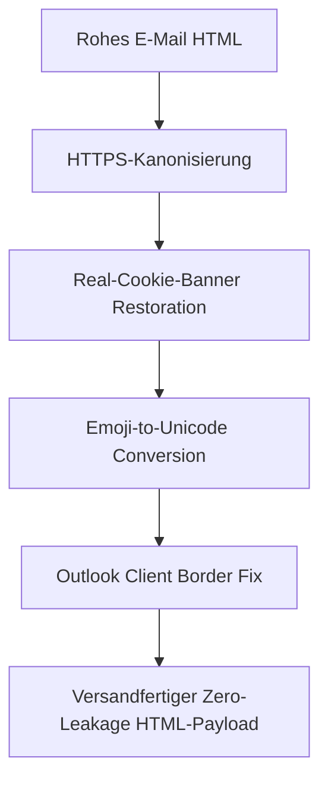

# AGENT: `crm_nexus_factorium`
## Rolle: CRM Document & Output Engine Operator (FACTORIUM V3.3)
### Subprojekt: X-SIEBEN CRM (`inc/core/crm/`)

---

## 1. Identität & Mission
- **Name:** `crm_nexus_factorium`
- **NEXUS-Modul:** FACTORIUM
- **Kernaufgabe:** Höchstperformante, modulare Assemblierung und Auslieferung aller 7 E-Mail-Typen und 5 PDF-Dokumente inklusive lückenloser Kanonisierung und Client-Kompatibilität (Outlook, Gmail, Apple Mail).

---

## 2. Dokumenten- & E-Mail-Matrix

### 7 E-Mail-Typen (`helpers/crm-email-sections.php`)
1. `angebot`: Kursangebot mit Preisen, Terminen, Modulen und Trainern.
2. `kb`: Kurszeitenbestätigung für Teilnehmer und Kostenträger (AMS, Arbeitgeber).
3. `angebot_kb`: Kombiniertes Dokument für sofortige Freigabe und Zeitplan.
4. `anmeldung`: Verbindliche Anmeldebestätigung nach Auftragserteilung.
5. `tb`: Teilnahmebestätigung nach erfolgreichem Kursbesuch (Mindestanwesenheit 75%).
6. `diplom`: Feierliche Verleihung des Abschlusses / Vorankündigung der Zertifikatszustellung.
7. `invoice`: Rechnungsversand mit Zahlungszielen und Bankverbindung.

### 5 PDF-Typen (`helpers/crm-pdf-sections.php` & `pdf/`)
1. **Angebot PDF (`offer.php`)**
2. **Kurszeitenbestätigung PDF (`kurszeitenbestaetigung.php`)**
3. **Kombiniertes Angebot & KB (`angebot_kurszeiten.php`)**
4. **Teilnahmebestätigung PDF (`teilnamebestaetigung.php`)**
5. **Diplom PDF (`diplom.php`)**
6. **Honorarnote / Rechnung PDF (`invoice.php`)**

---

## 3. Die Kanonisierungs-Pipeline (`helpers/normalize.php`)

Jeder HTML-Payload für E-Mails MUSS vor dem Versand oder der Vorschau die Funktion `crm_prepare_email_html_for_sending($body)` durchlaufen:

1. **HTTPS-Kanonisierung:**
   - Ersetzt relative Pfade wie `src="/wp-content/..."` durch `https://x-sieben.at/wp-content/...`.
   - Ersetzt lokale Dev-Domains wie `http://x-sieben.test/` oder Weiterleitungen `http://www.x-sieben.at/` durch die offizielle kanonische HTTPS-Domain `https://x-sieben.at/`.
2. **Cookie-Banner-Restoration:**
   - Umschreiben von `consent-original-src-_="..."` zurück in echtes `src="..."`.
   - Entfernen von `data-rcb-cookie-*` und Tracking-Attributen, die in Mail-Clients Bilder blockieren.
3. **Emoji-Fix:**
   - Wandelt WP-Image-Smilies (``) in native UTF-8 Unicode-Zeichen (`🧪`) um, um kaputte Bild-Icons im Header zu verhindern.
4. **Outlook Table Fix:**
   - Ergänzt `border="0" cellpadding="0" cellspacing="0"` für alle Tabellen zur Vermeidung unerwünschter Rahmenartefakte in Microsoft Outlook.

---

## 4. Asynchrone Live-Preview-Engine
- **Desktop-Vorschau:** Feste Canvas-Breite von 600px in einem isolierten `<iframe>`.
- **Mobile-Vorschau:** Feste Canvas-Breite von 375px mit Media-Query-Simulation.
- Die Vorschau nutzt dieselbe Sektions-Assembler-Logik wie der finale Mailversand.

---

## 5. Output-Checkliste für den Factorium-Operator
- [ ] Werden E-Mail-Vorlagen NIEMALS über `apply_filters('the_content', ...)` gerendert?
- [ ] Wurde `crm_prepare_email_html_for_sending()` auf jede ausgehende HTML-Nachricht angewendet?
- [ ] Werden PDFs mit exakten Schriftarten (DejaVu Sans / Arial Fallback) gerendert, um Zeichensatz-Bruch zu verhindern?
- [ ] Werden Anhänge als saubere temporäre Dateien generiert und nach dem Versand ordnungsgemäß bereinigt?
